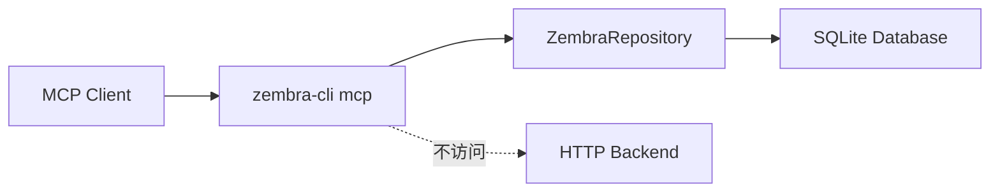

# Local MCP Server 设计文档

日期：2026.06.11

需求澄清文档：`docs/request-clarify/mcp/rm001-local-mcp-server.md`

## 核心功能（WHAT）

为 `zembra-cli` 增加本地 MCP Server，通过 `zembra-cli mcp` 启动。MCP Server 使用 stdio transport 与 MCP client 通信，并直接通过 `ZembraRepository` 访问本地 SQLite 数据库。

## 需求背景（WHY）

当前 `zembra-cli` 已经支持 direct SQLite 模式和 HTTP backend 模式。用户希望新增一条面向 AI/MCP 客户端的本地链路，让 MCP client 可以直接读写 Zembra 数据库，而不需要启动 backend 服务。

## 需求目标（GOAL）

| 目标 | 说明 |
| --- | --- |
| 本地 MCP 服务 | 通过 `zembra-cli mcp` 启动 stdio MCP Server |
| 数据库直连 | 只读取 direct SQLite 配置，不使用 HTTP mode |
| Tools 优先 | 第一阶段只暴露 MCP tools，不暴露 resources/prompts |
| 结果结构化 | tool 返回 Pydantic model dump 后的 JSON 兼容数据 |
| 默认 Agent 写入 | MCP 创建 note 时默认 `role="Agent"` |
| 现有行为稳定 | 不改变现有 CLI 命令和 HTTP repository |

## 范围边界

| 纳入范围 | 不纳入范围 |
| --- | --- |
| 新增 `src/zembra_cli/mcp_server.py` | MCP Resources |
| 新增 `zembra-cli mcp` 子命令 | MCP Prompts |
| 新增 MCP 依赖 | 远程 MCP transport |
| 复用 `ZembraRepository` direct SQLite 能力 | backend 启动或 backend API 适配 |
| MCP tool 自动化测试 | schema 迁移或数据同步 |
| README MCP 使用说明 | 客户端专属配置生成器 |

## 实现流程（HOW）

### 模块与入口

| 位置 | 设计 |
| --- | --- |
| `src/zembra_cli/mcp_server.py` | MCP Server 构建、配置加载、tool 注册 |
| `src/zembra_cli/cli.py` | 新增 `mcp` 子命令，调用 MCP Server runner |
| `pyproject.toml` | 增加 MCP Python SDK 依赖 |
| `tests/test_mcp_server.py` | 覆盖 direct 配置、tool 行为、错误路径 |

`mcp_server.py` 不应向 stdout 输出普通日志。stdio transport 的 stdout 由 MCP JSON-RPC 协议占用；错误日志只允许走 stderr 或 loguru 的 stderr sink。

### 配置与数据库连接

MCP Server 使用新的 direct-only 打开函数，逻辑与 CLI direct 模式保持一致，但不接受 HTTP 模式：

| 配置场景 | 行为 |
| --- | --- |
| `[cli].mode = "direct"` 且 `[database].path` 有效 | 打开 SQLite，创建 `ZembraRepository` |
| `[cli].mode = "http"` | 失败，提示 MCP Server requires direct database mode |
| 缺少 config 或 database path | 沿用现有配置错误信息 |
| 数据库缺失或核心表缺失 | 沿用 `require_initialized_database` 的校验语义 |

连接生命周期由 tool 调用边界管理。推荐每次 tool 调用打开一次 SQLite connection，执行完成后关闭，避免长时间 stdio server 持有连接导致后续外部进程写入时出现锁等待。

### MCP Tools

第一批 tools 只覆盖已确认能力：

| Tool | 输入 | 行为 | 返回 |
| --- | --- | --- | --- |
| `create_note` | `content`，可选 `field_name`、`tag_names`、`role` | 创建 note，默认 `role="Agent"` | `NoteRecord` 字典 |
| `list_notes` | 可选 `include_deleted` | 读取本地 notes | `list[NoteRecord]` |
| `list_tags` | 无 | 读取本地 tags | `list[TagRecord]` |
| `list_fields` | 无 | 读取本地 fields | `list[FieldRecord]` |
| `random_notes` | `number` | 读取随机可见 notes | `list[NoteWithMetadata]` |

`create_note.role` 只允许 `Human` 或 `Agent`。默认值为 `Agent`，保留 `Human` 是为了允许明确记录人类来源的导入或修正场景。

### 返回结构

所有返回值先通过 Pydantic `model_dump(mode="json")` 转为 JSON 兼容结构。列表结果返回对象数组，不额外包装成人类可读文本。

| 类型 | 返回策略 |
| --- | --- |
| `NoteRecord` | `note.model_dump(mode="json")` |
| `TagRecord` / `FieldRecord` | `record.model_dump(mode="json")` |
| `NoteWithMetadata` | 包含 `note`、`field`、`tags` 的完整嵌套结构 |
| 空结果 | 返回空列表 |

### 错误处理

| 场景 | 行为 |
| --- | --- |
| HTTP mode 配置 | tool 或 server 初始化返回清晰错误 |
| 数据库未初始化 | 返回数据库未初始化错误 |
| SQLite 错误 | 返回面向 MCP client 的错误消息 |
| `content` 为空 | 由当前 repository/schema 行为处理，不额外扩展校验 |
| `number < 1` | MCP tool 返回参数错误 |

## 测试用例

### 编译检查

| 检查 | 预期 |
| --- | --- |
| `uv run pytest tests/test_mcp_server.py -q` | MCP server 定向测试通过 |
| `uv run pytest tests/test_cli.py -q` | CLI 入口回归通过 |
| `uv run pytest -q` | 全量测试通过 |
| `uv run ruff check .` | lint 通过 |

### 自动化测试

| 测试 | 预期 |
| --- | --- |
| direct config 打开 repository | 成功读取 SQLite 并执行 tool |
| HTTP config 拒绝 MCP | 不创建 HTTP repository，返回清晰错误 |
| `create_note` 默认 role | 新增 note 的 `role` 为 `Agent` |
| `create_note` 显式 role | `Human` / `Agent` 均可写入 |
| `list_notes` | 返回本地 note 字典数组 |
| `list_tags` / `list_fields` | 返回本地 taxonomy 字典数组 |
| `random_notes` | 返回带 field/tags 的结构化结果 |
| 数据库缺失 | 返回数据库未初始化错误 |

### 回归检查

| 场景 | 预期 |
| --- | --- |
| `zembra-cli add` | 行为不变化 |
| `zembra-cli list tags` / `list fields` | 行为不变化 |
| `zembra-cli random notes` | 行为不变化 |
| HTTP mode CLI 命令 | 仍通过 `HttpZembraRepository` 工作 |

